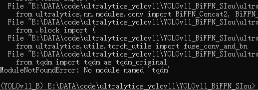

# YOLOv11_BiFPN_SIou

This repository contains the implementation of the paper titled "Deep learning to detect stone burial sites from drone
image in the southern foothills of the Tianshan Mountains in Xinjiang, China". The project integrated YOLOv11 with a
Bidirectional Feature Pyramid Network (BiFPN) and improved the loss function to enhance the accuracy of detecting
stone burial sites in drone imagery.

## Overview
The stone burial site (SBS), as important historical relics, a thorough understanding of their spatial distribution and 
quantity is important for promoting regional civilization cognition. Remote sensing techniques and artificial Intelligence 
methods can greatly facilitate rapid surveys and inventories of archaeological sites. This study applied drone imagery 
and a deep convolutional neural network-based object detection model to quickly and accurately identify SBS, thereby 
facilitating archaeological discoveries and the establishment of inventories in the field. 

## Features

- **YOLOv11_BiFPN_SIou**: An enhanced version of YOLOv11 with bidirectional feature pyramid networks (BiFPN) and an improved 
                     loss function for multi-scale feature fusion.

## Installation

### Prerequisites

- Python 3.8+
- PyTorch 2.0
- CUDA 11.8 (for GPU support)
- Other dependencies listed in `requirements.txt`

### Steps

1. **Download the stone burial site deep learning dataset **:
   ```sh
   Dataset download link: https://zenodo.org/records/17192944
   #Download the stone burial site deep learning dataset (datasets.zip), extract it, and save it to the YOLOv11_BiFPN_SIou folder downloaded in Step 2. Note that the datasets folder directly contains images and 
   labels.


2. **Clone the repository**:
  ```sh
   git clone https://github.com/Changping-Li/YOLOv8_BiFPN_SIou.git
   ```
 
3. Install Anaconda3
   ```sh
   Download link: https://repo.anaconda.com/miniconda/  (Recommended download: Miniconda3-py39_24.9.2-0-Windows-x86_64, During installation, you must tick the box for ‘Add Anaconda to my PATH environment variable’.)
   ```

4. **Setting up a PyTorch environment**:
   ```sh
     conda create -n YOLOv11 python=3.9
   ```
5. **Activate the created environment**:
  ```sh
   conda activate YOLOv11
  ```
6. **Install dependencies**:
 ```sh
    pip3 install torch torchvision --index-url https://download.pytorch.org/whl/cu128
    # The CUDA version must be compatible with your current device.


  ```
  
7. **Install YOLOv11**:
    ```sh
    pip install ultralytics
  ```

8. **Go to the code folder path**:
   cd YOLOv11_BiFPN_SIou-main
 

## Usage

### Training

To train the YOLOv11_BiFPN_SIou model:
 ```sh
  python mytrain.py --batch 32
  #When GPU memory is insufficient, one may attempt to reduce the batch size, for example, --batch 8.
  #As shown in the figure below, should an error message such as ‘No module named “tqdm”’ appear, proceed with installation using the command ‘pip install “xxxx”’.
  #
  #As shown in the figure below, the model will begin training and the process will take several hours.
  #The accuracy evaluation metrics for the model training process will be saved to the path:runs/train/exp
  
 ```

### Evaluation

To evaluate the model:
```sh
  python mypre.py
  #The prediction results can be viewed using image viewing software.
```

## File Structure

The core code directory of YOLOv11 contains all the code that implements the model's functionality.

### 1 ultralytics/assets

    Contains the project's static resources, such as images, pre-trained model files, etc. These resources are used for testing, documentation, or software examples.

### 2 ultralytics/yolo/cfg

    Stores configuration files that define the model's structure, training parameters, etc.

2.1 ultralytics/cfg/init.py
    
    The initialization file of the Python package, used to mark the current directory as part of the Python package. This allows the package's modules to be referenced by external code.

2.2 ultralytics/cfg/default.yaml

    This is a YAML configuration file containing the default configuration settings for YOLOv8. These settings include training parameters, model options, data processing methods, etc.

### 3 ultralytics/datasets
    
    This folder contains configuration files related to different datasets. These configuration files define how to load and preprocess datasets, the structure and attributes of the datasets, etc.

### 4 ultralytics/data
    
    Contains scripts and files related to data processing, such as dataset configuration files or data preprocessing code. This is crucial for model training and testing.

### 5 ultralytics/engine
        
    Contains the core functionality code of YOLOv8, such as model training, validation, and inference.

5.1 ultralytics/engine/init.py
    
    The initialization file of the Python package, used to mark the engine directory as a Python module.

5.2 ultralytics/engine/exporter.py
    
    Code responsible for exporting the model. This includes functionality for exporting the trained model to different formats (e.g., ONNX, TensorFlow, TorchScript, etc.).

5.3 ultralytics/engine/model.py
    
    Contains code for model construction and management. This involves defining the model architecture, loading model parameters, performing model inference, etc.

5.4 ultralytics/engine/predictor.py

    Implements model prediction functionality. This includes processing input data, performing model inference, returning prediction results, etc.

5.5 ultralytics/engine/results.py
    
    Used to handle and display model prediction results. This involves calculating performance metrics, generating result reports, etc.

5.6 ultralytics/engine/trainer.py

    Code responsible for model training. This includes setting up the training loop, optimizers, loss functions, etc.

5.7 ultralytics/engine/validator.py

    Implements model validation functionality. This includes running the model on the validation set, calculating and reporting performance metrics, etc.

### 6 ultralytics/hub
    
    Code integrated with PyTorch Hub, allowing users to easily download and use YOLOv8 models. This includes helper scripts for model loading and execution.

### 7 ultralytics/nn
        
    Contains code for neural network components, such as custom layers, activation functions, etc.

### 8 ultralytics/tracker
        
    Contains code related to object tracking. This supports tracking detected objects in videos or real-time streams.

### 9 ultralytics/utils
    
    Contains various utilities and helper functions, such as image processing, performance metric calculations, etc.

9.1 ultralytics/utils/callbacks
    
    Contains callback functions used during the training process. These functions are called at specific points during model training to log information such as training loss and learning rate.

9.2 ultralytics/utils/init.py
        
    The initialization file of the utils directory, marking it as a Python module.

9.3 ultralytics/utils/autobatch.py
        
    Contains functionality for automatic batch processing, optimizing efficiency when handling large amounts of data.

9.4 ultralytics/utils/benchmarks.py
        
    Contains functions for performance benchmarking, used to evaluate the model's speed and efficiency.

9.5 ultralytics/utils/checks.py
        
    Provides functions for checking and validating data or model status.

9.6 ultralytics/utils/dist.py
        
    Contains functionality related to distributed training, such as solving a bug in Python argparse during Distributed Data Parallel (DDP) training.

9.7 ultralytics/utils/downloads.py
        
    Contains functions related to downloading, such as downloading pre-trained models or other resources.

9.8 ultralytics/utils/errors.py
        
    Defines custom errors and exception handling functions.

9.9 ultralytics/utils/files.py
        
    Contains functions related to file operations, such as reading and writing files.

9.10 ultralytics/utils/instance.py
        
    Contains functions related to instances (objects), used for handling operations on a single model instance.

9.11 ultralytics/utils/loss.py
        
    Contains definitions and implementations of loss functions, which are crucial for the training process.

9.12 ultralytics/utils/metrics.py
    
    Contains functions for calculating and reporting performance metrics.

9.13 ultralytics/utils/ops.py
        
    Contains various operations and functions.

9.14 ultralytics/utils/patches.py
        
    Contains code patches related to fixing or improving existing functionality.

9.15 ultralytics/yutils/plotting.py
        
    Provides data visualization functions, such as plotting graphs.

9.16 ultralytics/utils/tal.py
        
    Contains tools and functions for specific application logic.

9.17 ultralytics/utils/torch_utils.py
        
    Contains helper functions related to the PyTorch framework.

9.18 ultralytics/utils/triton.py
        
    Contains functionality for integrating with NVIDIA Triton inference server.

9.19 ultralytics/utils/tuner.py
        
    Provides functionality for model tuning and hyperparameter search.

### 10 ultralytics/init.py
    The initialization file of the Python package, marking the current directory as part of the Python package.

These directories and files collectively form the foundation of YOLOv11-BiFPN_SIou, from data processing and model configuration to the actual training and inference engine, as well as utility tools and advanced functionalities. Each component plays a crucial role in the overall functionality and performance of the framework.


## Methodology

### YOLOv11_BiFPN_SIou Architecture

In the task of using drones to detect foreign objects on transmission lines, there are often complex and variable environmental conditions such as weather, lighting, and background interference. The linear structure of power lines and the diversity of foreign objects increase the difficulty of detection.

**Bidirectional Feature Pyramid Network (BiFPN)**: 
- Enhances the performance of target detection by introducing a BiFPN structure into the detection head of YOLOv8.
- BiFPN is integrated during the process of connecting three layers of the network to form the detection head.
- This structure enhances multi-scale feature fusion and bidirectional information transmission, allowing the network to adapt better to complex environmental conditions and diverse target morphologies.

**Loss Functions**:
- **Classification Loss**: Binary Cross-Entropy (BCE) is employed as the classification loss.
- **Regression Loss**: The regression branch employs Distribution Focal Loss (DFL) and CIoU Loss for bounding box optimization.

Here is the architecture of our YOLOv11-BiFPN_SIou:


## Dataset

**SBS**:
- A dataset of stone burial sites.
- Comprises a total of 6980 annotated images
- Annotations saved in XML format following the PASCAL VOC standard, supporting YOLO format.
- Split into training (5590 images) and testing (1390 images) sets.

Here is the example image of our dataset:


## Contribution

We welcome contributions from the community. Please feel free to submit pull requests or open issues for any bugs or feature requests.

